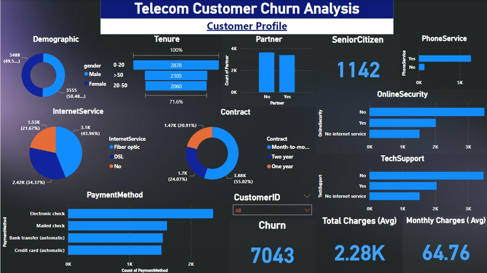
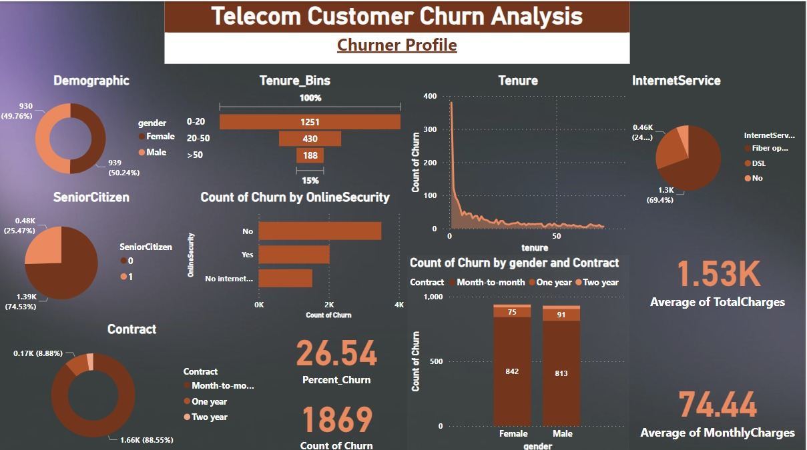

# 📊 Telecom Analysis for Customer

### **Introduction**
Customers in the telecom industry are invaluable assets. As the **Retention Manager** from our telecom client rightly pointed out, losing a customer is not an option. A few weeks after we presented the **"Telecom Customer Churn Analysis - Power BI Dashboard"** to the management, the Retention Manager reached out directly to **Shantanu**. He was impressed by the work and requested a more detailed dashboard focusing on **customer retention**.


*Figure 1: Telecom Customer Churn Analysis Dashboard*


*Figure 2: Telecom Customer Churn Analysis Dashboard2*

### **Project Details**

#### **What is Churn?**
**Churn** refers to the rate at which customers stop doing business with a company or service. It is typically expressed as a **percentage** of the customer base.

#### **What is a Churn Rate?**
**Churn Rate** (also known as the **attrition rate**) is the rate at which customers stop doing business with a company over a given period. Churn may also apply to the number of subscribers who cancel or don’t renew a subscription. 

- **Formula**:  
  ```markdown
  Churn Rate = (Churned Customers / Total Number of Customers) x 100%
  ```
- **Impact**:  
  - A **higher churn rate** indicates that more customers are leaving your business.
  - A **lower churn rate** means more customers are being retained, which is generally a positive indicator.

#### **What is Customer Churn?**
**Customer Churn** is a natural part of the business cycle, involving the loss and acquisition of customers. Every company experiences churn, regardless of the quality of its products or customer service. In business, customer churn can occur due to factors such as:

- **Dissatisfaction** with the product or service.
- **Competitive offerings**.
- **Changes in customer circumstances** or preferences.

The general rule is: the **less churn** a company has, the **more customers** they retain.

### **Next Steps**
We will continue to work on the **customer retention dashboard** and explore **advanced analytical techniques** to proactively identify at-risk customers, helping the telecom client to **reduce churn** and **increase customer loyalty**.
